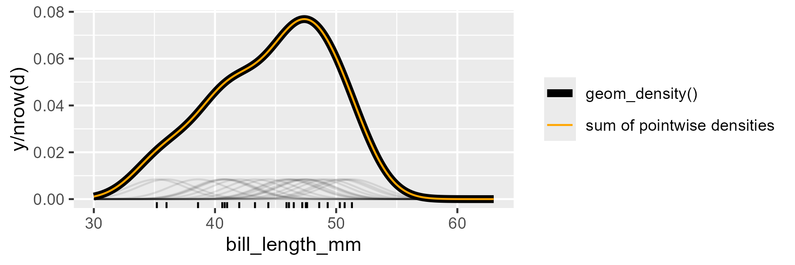

<!--- Timestamp to trigger book rebuilds: 2024-01-19 10:09:52.253048 --->


## November 2021

<small>Source: <code>2021-11-22.Rmd</code></small>

### Quick hits

**Base graphics in knitr**. I learned while porting over some old notes
that `par()` options are not preserved between knitr chunks unless
`opts_knit$get("global.par")` is `TRUE`. It's `FALSE` by default. No
funny business using `old <- par(...)`

**Sampling a swimming pool depth**. Jorbs on his Slay the Spire stream
commented problems with big data. He used [a nice
analogy](https://www.youtube.com/watch?v=kHS-tFnJKqA&t=5712s) for
sampling bias. Imagine you have a swimming pool and we can't see the
bottom of it. We want to measure the average depth of it. No amount of
big data will accurately estimate the depth with all the samples come
from the shallow end of the pool. But if you smartly sample the pool
with a grid of points, then you can come up with an accurate estimate
from relatively few points. This example is nice because it can
illustrate accuracy versus precision.

The analogy also funnily resembles an analogy used for Hamilitonian
Monte Carlo: a puck skating around a smooth curved surface. If the pool
is the posterior distribution and the depth is the negative log
posterior density, then we want to explore that pool too. 

***

Paul recommended using Frank Harrell's `rms::orm()` function for ordinal
regression.

### `eval()` is stack inconsistent (whatever that means)

`base::eval()` and `rlang::eval_bare()` [do things differently](https://rlang.r-lib.org/reference/eval_bare.html).

Here are the examples from `?eval_bare()`


```r
# eval_bare() works just like base::eval() but you have to create
# the evaluation environment yourself:
eval_bare(quote(foo), env(foo = "bar"))
#> [1] "bar"

# eval() has different evaluation semantics than eval_bare(). It
# can return from the supplied environment even if its an
# environment that is not on the call stack (i.e. because you've
# created it yourself). The following would trigger an error with
# eval_bare():
ret <- quote(return("foo"))
eval(ret, env())
#> [1] "foo"
# eval_bare(ret, env())  # "no function to return from" error

# Another feature of eval() is that you can control surround loops:
bail <- quote(break)
while (TRUE) {
  eval(bail)
  # eval_bare(bail)  # "no loop for break/next" error
}

# To explore the consequences of stack inconsistent semantics, let's
# create a function that evaluates `parent.frame()` deep in the call
# stack, in an environment corresponding to a frame in the middle of
# the stack. For consistency with R's lazy evaluation semantics, we'd
# expect to get the caller of that frame as result:
fn <- function(eval_fn) {
  list(
    returned_env = middle(eval_fn),
    actual_env = current_env()
  )
}
middle <- function(eval_fn) {
  deep(eval_fn, current_env())
}
deep <- function(eval_fn, eval_env) {
  expr <- quote(parent.frame())
  eval_fn(expr, eval_env)
}

# With eval_bare(), we do get the expected environment:
fn(rlang::eval_bare)
#> $returned_env
#> <environment: 0x55cac3595df8>
#> 
#> $actual_env
#> <environment: 0x55cac3595df8>
#> 

# But that's not the case with base::eval():
fn(base::eval)
#> $returned_env
#> <environment: 0x55cac1cc7980>
#> 
#> $actual_env
#> <environment: 0x55cac1cc2170>
#> 
```

### The Gaussian KDE is a sum of baby Gaussians?!

Today I learned [from
here](https://support.numxl.com/hc/en-us/articles/216478703-Kernel-density-estimation-KDE-Plot)
that the Gaussian KDE is the sum of a bunch of little Gaussian curves.
Here look:


```r
library(tidyverse)
#> Warning: package 'dplyr' was built under R version 4.3.2
#> Warning: package 'stringr' was built under R version 4.3.2
#> ── Attaching core tidyverse packages ──────────────────────── tidyverse 2.0.0 ──
#> ✔ dplyr     1.1.4     ✔ readr     2.1.4
#> ✔ forcats   1.0.0     ✔ stringr   1.5.1
#> ✔ ggplot2   3.4.4     ✔ tibble    3.2.1
#> ✔ lubridate 1.9.3     ✔ tidyr     1.3.0
#> ✔ purrr     1.0.2     
#> ── Conflicts ────────────────────────────────────────── tidyverse_conflicts() ──
#> ✖ dplyr::filter() masks stats::filter()
#> ✖ dplyr::lag()    masks stats::lag()
#> ℹ Use the conflicted package (<http://conflicted.r-lib.org/>) to force all conflicts to become errors
library(palmerpenguins)

d <- penguins %>% 
  filter(!is.na(bill_length_mm)) %>% 
  sample_n(size = 20)

# grid of xs
x <- seq(30, 63, length.out = 200)

# compute density of xs using each observed value
# as the mean.
l <- lapply(
  d$bill_length_mm,
  function(m) {
    data.frame(
      x = x,
      y = dnorm(x, mean = m, sd = bw.nrd0(d$bill_length_mm)) 
    )
  }
) 
dl <- bind_rows(l, .id = "obs")

# plot them, their sum, and the default density curve
ggplot(d) + 
  aes(x = bill_length_mm) + 
  geom_density(aes(color = "geom_density()"), size = 2, show.legend = FALSE) +
  geom_rug() +
  geom_line(
    aes(x = x, y = y / nrow(d), group = obs),
    data = dl, alpha = .1
  ) + 
  stat_summary(
    aes(x = x, y = y / nrow(d), color = "sum of pointwise densities"),
    data = dl, 
    # alpha = .1, 
    geom = "line",
    fun = "sum", 
    # color = "orange"
  ) +
  scale_color_manual(values = c("black", "orange")) +
  labs(color = NULL)
#> Warning: Using `size` aesthetic for lines was deprecated in ggplot2 3.4.0.
#> ℹ Please use `linewidth` instead.
#> This warning is displayed once every 8 hours.
#> Call `lifecycle::last_lifecycle_warnings()` to see where this warning was
#> generated.
```

<figure>
  
  <figcaption></figcaption>
</figure>

### Using closures to make 16 related functions

The [R Open Sci
newsletter](https://ropensci.org/blog/2021/11/30/ropensci-news-digest-november-2021/#function-specific-and-package-specific-environments)
linked to [a mailing list
thread](https://www.mail-archive.com/r-package-devel@r-project.org/msg07413.html)
about how to stash data inside of an R package.

Duncan Murdoch suggests using a function factory to create closures that
can access data in the parent environment.

> Your `local()` call can create several functions and return them in a
> list; then just those functions have access to the local variables.
> For example,
> 
> ```r
> createFns <- function() {
> 
>    .fooInfo <- NULL
> 
>    fn1 <- function (...) { ... }
>    fn2 <- function (...) { ... }
> 
>    list(fn1 = fn1, fn2 = fn2)
> }
> 
> fns <- createFns()
> fn1 <- fns$fn1
> fn2 <- fns$fn2
> ```
> 
> Now `fn1` and `fn2` are functions that can see `.fooInfo`, and nobody
> else can (without going through contortions).

(I had to fix the code to create a real function factory.) 

Then Martin Mächler replies to say yup, this is what we do in base R.

> Note that the above approach has been how `nls()` has been
> implemented for R ... a very long time ago {before R 1.0.0}
> 
> e.g. from  `example(nls)`:
> 
> 
> ```r
> DNase1 <- subset(DNase, Run == 1)
> fm1 <- nls(density ~ SSlogis(log(conc), Asym, xmid, scal), DNase1)
> str(fm1$m)
> #> List of 16
> #>  $ resid     :function ()  
> #>  $ fitted    :function ()  
> #>  $ formula   :function ()  
> #>  $ deviance  :function ()  
> #>  $ lhs       :function ()  
> #>  $ gradient  :function ()  
> #>  $ conv      :function ()  
> #>  $ incr      :function ()  
> #>  $ setVarying:function (vary = rep_len(TRUE, np))  
> #>  $ setPars   :function (newPars)  
> #>  $ getPars   :function ()  
> #>  $ getAllPars:function ()  
> #>  $ getEnv    :function ()  
> #>  $ trace     :function ()  
> #>  $ Rmat      :function ()  
> #>  $ predict   :function (newdata = list(), qr = FALSE)  
> #>  - attr(*, "class")= chr "nlsModel"
> 
> # so 16 functions, all sharing the *same* environment very
> # efficiently and nicely
> 
> # this is *the* environment for the fitted model:
> fmE <- environment(fm1$m[[1]])
> ls.str(fmE)
> #> convCrit : function ()  
> #> dev :  num 0.00479
> #> env : <environment: 0x0000019593a22150> 
> #> form : Class 'formula'  language density ~ SSlogis(log(conc), Asym, xmid, scal)
> #> getPars : function ()  
> #> getPars.noVarying : function ()  
> #> getPars.varying : function ()  
> #> getRHS : function ()  
> #> getRHS.noVarying : function ()  
> #> getRHS.varying : function ()  
> #> gradCall :  language attr(ans, "gradient")[c(TRUE, TRUE, TRUE, TRUE, TRUE, TRUE, TRUE, TRUE,  TRUE, TRUE, TRUE, TRUE, TRUE, TRUE, TRUE| __truncated__ ...
> #> ind : List of 3
> #>  $ Asym: int 1
> #>  $ xmid: int 2
> #>  $ scal: int 3
> #> internalPars :  Named num [1:3] 2.35 1.48 1.04
> #> lhs :  num [1:16] 0.017 0.018 0.121 0.124 0.206 0.215 0.377 0.374 0.614 0.609 ...
> #> nDcentral :  logi FALSE
> #> npar :  int 3
> #> QR : List of 4
> #>  $ qr   : num [1:16, 1:3] -1.5221 0.0086 0.0314 0.0314 0.0584 ...
> #>  $ rank : int 3
> #>  $ qraux: num [1:3] 1.01 1.03 1.28
> #>  $ pivot: int [1:3] 1 2 3
> #> resid :  num [1:16] -0.01368 -0.01268 0.00895 0.01195 -0.00258 ...
> #> rhs :  num [1:16] 0.0307 0.0307 0.1121 0.1121 0.2086 ...
> #> scaleOffset :  num 0
> #> setPars : function (newPars)  
> #> setPars.noVarying : function (newPars)  
> #> setPars.varying : function (newPars)  
> #> upper :  NULL
> #> useParams :  logi [1:3] TRUE TRUE TRUE
> #> wts :  num [1:16] 1 1 1 1 1 1 1 1 1 1 ...
> ```
> 
> so the environment "contains" the functions themselves (but quite
> a few more things) and for an environment that means it only
> has pointers to the same function objects which are *also* in `fm1$m`.
> 
> **So, there has been a nice convincing and important example on
> how to do this - inside R for more than two decennia.**

Final emphasis was added by me. 
