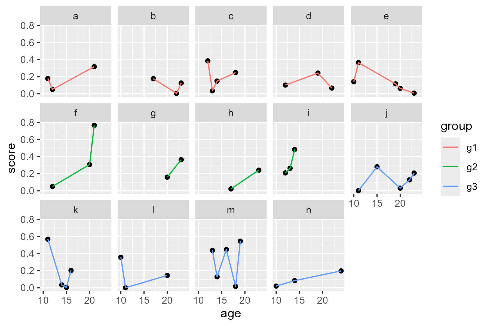
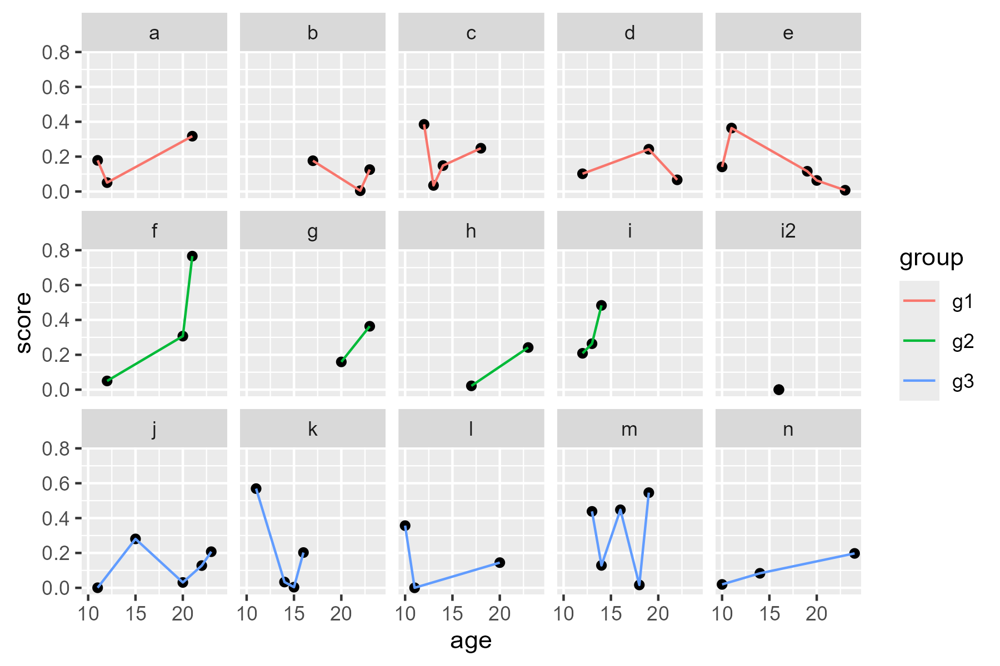
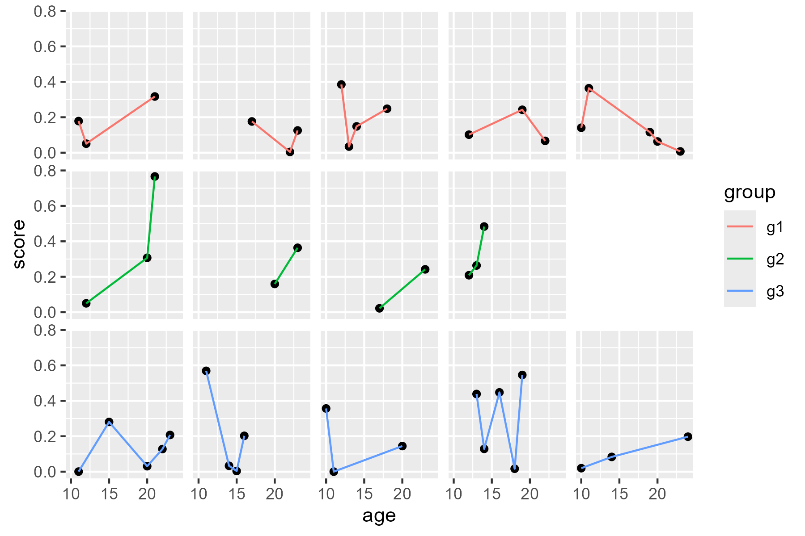
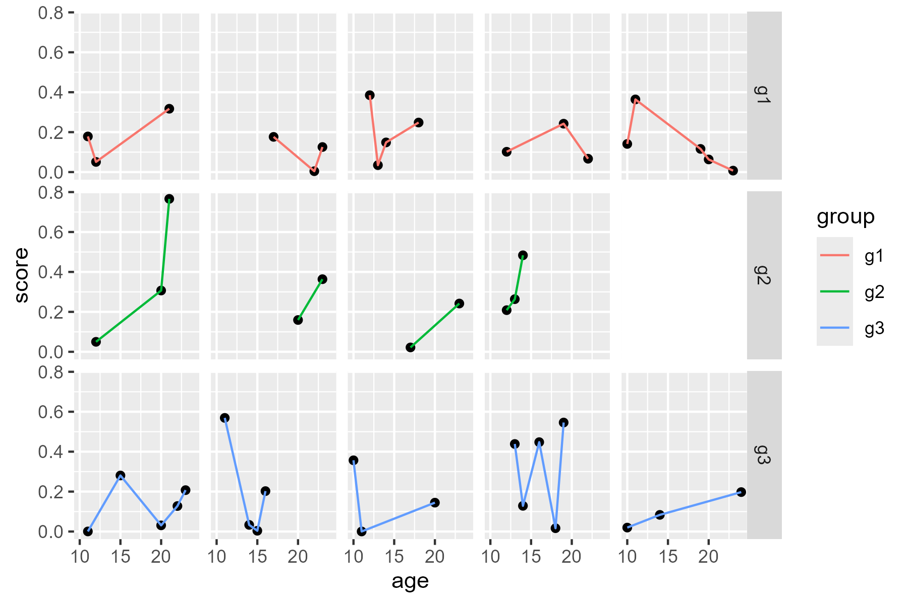

<!--- Timestamp to trigger book rebuilds: 2022-01-21 12:04:52 --->


## January 2022

<small>Source: <code>2022-01-21.Rmd</code></small>

**New interesting R packages**. 

  - ggdensity An R package for interpretable visualizations of density
    estimates <https://github.com/jamesotto852/ggdensity>
      - the README has a good figure showing a multivariate normal
        distribution will mess up the density for a bimodal region
  - khroma 🎨 Colour Schemes for Scientific Data Visualization
    <https://github.com/tesselle/khroma>
  - geomtextpath Create curved text paths in ggplot2
    <https://github.com/AllanCameron/geomtextpath>

**Easy way to sample from a multinomial**.

<blockquote class="twitter-tweet" data-dnt="true">
<p lang="en" dir="ltr">sample() takes a prob argument, so you can skip rmultinom entirely!<br><br>sample(n_comp, n, prob = mixture_probs, replace = TRUE)</p>
&mdash; David Robinson (@drob) <a href="https://twitter.com/drob/status/1453453742343442437?ref_src=twsrc%5Etfw">October 27, 2021</a>
</blockquote>


**How to conditionally provide tibbles**. The [newsletter by
rOpenSci](https://ropensci.org/blog/2022/01/21/ropensci-news-digest-january-2022/#to-quote-or-not-to-quote-non-existing-words-in-description)
highlights this trick by the palmerpenguins package.


```r
delayedAssign("penguins", {
  if (requireNamespace("tibble", quietly = TRUE)) {
    tibble::as_tibble(readRDS("data/penguins.rds"))
  } else {
    readRDS("data/penguins.rds")
  }
})

delayedAssign("penguins_raw", {
  if (requireNamespace("tibble", quietly = TRUE)) {
    tibble::as_tibble(readRDS("data/penguins_raw.rds"))
  } else {
    readRDS("data/penguins_raw.rds")
  }
})
```

This rOpenSci newsletter also detailed how to get new words past the
package description spellchecker.


### How to manually delete a facet cell

Suppose you have some ragged data.


```r
library(tidyverse)
data <- tibble(
  id = letters[1:14],
  group = rep(c("g1", "g2", "g3"), times = c(5, 4, 5)),
  data = lapply(1:14, function(x) {
    # just making some data
    n_points <- sample(c(2:5), size = 1) 
    ages <- sort(sample(c(10:24), size = n_points))
    data.frame(age = ages, score = rbeta(n_points, 1, 4))
  })
) %>% 
  tidyr::unnest(data)

ggplot(data, aes(x = age, y = score)) + 
  geom_point() + 
  geom_line(aes(color = group)) + 
  facet_wrap("id", ncol = 5)
```

<figure>
  
  <figcaption></figcaption>
</figure>

We would like to have one row per group. So we actually would want four
panels on the middle row. If we add an extra panel to fill that space and then
remove it, we can achieve this goal. 

First add the dummy panel.


```r
data <- data %>% 
  tibble::add_row(id = "i2", group = "g2", age = median(data$age), score = 0) %>% 
  # two points so that geom_line() doesn't warn
  tibble::add_row(id = "i2", group = "g2", age = median(data$age), score = 0)

ggplot(data, aes(x = age, y = score)) + 
  geom_point(na.rm = TRUE) + 
  geom_line(aes(color = group), na.rm = TRUE) + 
  facet_wrap("id", ncol = 5) 
```

<figure>
  
  <figcaption></figcaption>
</figure>


My **overly complicated approach** was to manually delete the grob using
the following. Finding the `pattern` name is very tedious because you
basically have to guess the strip and panel numbers.


```r
p <- last_plot()
g <- ggplotGrob(p)
# guess and check
pattern <- "panel-4-3|strip-t-5-2"
to_drop <- str_which(g$layout$name, pattern)
to_keep_names <- str_subset(g$layout$name, pattern, negate = TRUE)
# delete grob data, clean up layout table
g$grobs[to_drop] <- NULL
g$layout <- g$layout[g$layout$name %in% to_keep_names, ]
grid::grid.newpage()
grid::grid.draw(g)
```

<figure>
  
  <figcaption></figcaption>
</figure>

Although I am going to give better solution, I did write this entry
precisely to have this code here for my reference.

A better approach is to **blank the cell with a ribbon**. We have to eliminate
strip titles from the theme for this approach to work.


```r
ggplot(data, aes(x = age, y = score)) + 
  geom_point(na.rm = TRUE) + 
  geom_line(aes(color = group), na.rm = TRUE) + 
  geom_ribbon(
    aes(ymin = -Inf, ymax = Inf),
    data = tibble(
      id = "i2", 
      age = c(-Inf, Inf), 
      group = "g2", 
      score = NA_real_
    ),
    fill = "white",
    color = "white"
  ) +
  facet_wrap("id", ncol = 5) +
  theme(strip.text.x = element_blank())
```

<figure>
  
  <figcaption></figcaption>
</figure>

[Brenton on
Twitter](https://twitter.com/bmwiernik/status/1484263988137504771?s=20)
suggested numbering IDs *within* groups and using `facet_grid()`. That
works, and it also can give labeled rows.


```r
data <- data %>% 
  group_by(group) %>% 
  mutate(col_num = match(id, unique(id))) %>% 
  ungroup()

ggplot(data, aes(x = age, y = score)) + 
  geom_point(na.rm = TRUE) + 
  geom_line(aes(color = group), na.rm = TRUE) + 
  geom_ribbon(
    aes(ymin = -Inf, ymax = Inf),
    data = tibble(
      col_num = 5,
      age = c(-Inf, Inf), 
      group = "g2", 
      score = NA_real_
    ),
    fill = "white",
    color = "white"
  ) +
  facet_grid(group ~ col_num) +
  theme(strip.text.x = element_blank())
```

<figure>
  
  <figcaption></figcaption>
</figure>

