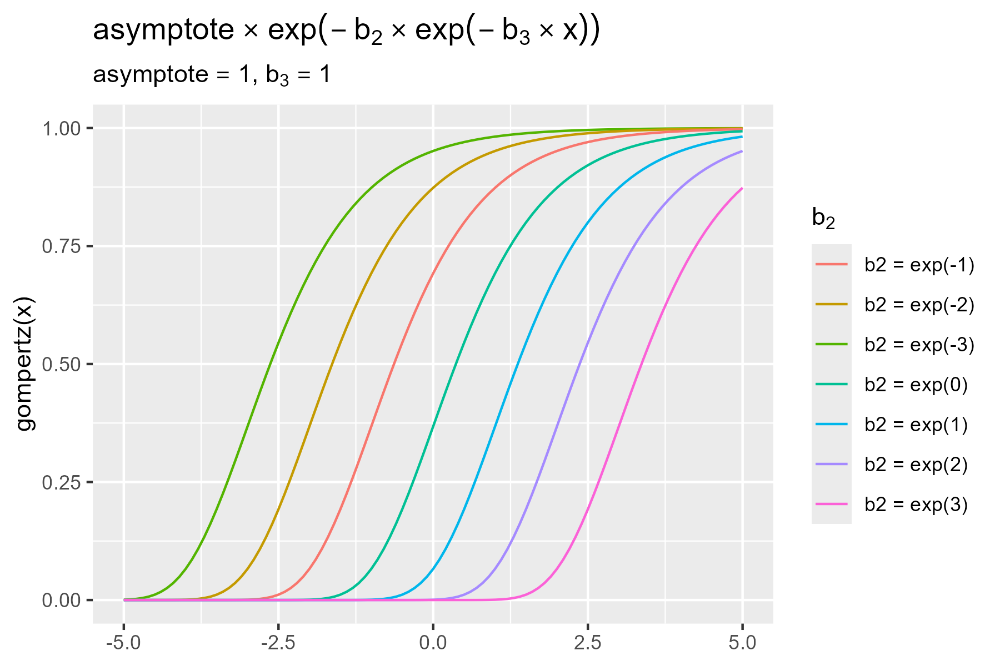

<!--- Timestamp to trigger book rebuilds: 2023-05-05 14:04:21.706211 --->


## May 2023

<small>Source: <code>2023-05-04.Rmd</code></small>


### Nonlinear model zoo

#### Gompertz 

The [Gompertz function](https://en.wikipedia.org/wiki/Gompertz_function)
"describes growth as being slowest at the start and end of a given time
period. The right-side or future value asymptote of the function is
approached much more gradually by the curve than the left-side or lower
valued asymptote." 

$$
f(t) = a\mathrm{e}^{-b\mathrm{e}^{-ct}} \\
a: \textrm{asymptote} \\
b: \textrm{translation left or right} \\
c: \textrm{growth factor} \\
$$

So we have two different growth rates but a single parameter relating to
growth rate. R's implementation (`stats::SSgompertz()`) "simplifies" the
double exponential into `Asym * exp(-b2 * b3 ^ x)`.

The scaling factor c or b3 makes sense in the original Gompertz
equation. I couldn't understand what the R version was doing because it was
changing the base of exponentiation.


```r
library(tidyverse)

gompertz <- function(xs, asym, b2, b3) {
  asym * exp(-b2 * exp(-b3 * xs))
}

# Make a quick ggplot2 layer of the gompertz function
stat_gompertz <- function(focus, asym, b2, b3, ...) {
  # show what i typed, not the values
  b2 <- rlang::enexpr(b2)
  asym <- rlang::enexpr(asym)
  b3 <- rlang::enexpr(b3)
  labs <- list(
    asym = rlang::expr_deparse(asym), 
    b2 = rlang::expr_deparse(b2), 
    b3 = rlang::expr_deparse(b3)
  )
  rlang::dots_list(asym, b2, b3, .named = TRUE)
  color <- sprintf("%s = %s", focus, labs[[focus]])
  stat_function(
    aes(color = color),
    fun = gompertz, 
    args = rlang::inject(list(asym = !! asym, b2 = !! b2, b3 = !! b3)),
    ...
  )
}

ggplot() + 
  xlim(-5, 5) +
  stat_gompertz("b3", 1, 1, 1) +
  stat_gompertz("b3", 1, 1, 0) +
  stat_gompertz("b3", 1, 1, .1) + 
  stat_gompertz("b3", 1, 1, -.5) +
  ggtitle(
      expression(asym %*% exp(-b[2] %*% exp(-b[3] %*% x)))
  )
```

<figure>
  
  <figcaption></figcaption>
</figure>

We have this weird feature where $b = 1/2$ and $b = 2$ are the same
distance from $b = 1$, and the distance between the $b = 2, 3, 4$ gets smaller.


```r
ggplot() + 
  xlim(-5, 5) +
  stat_gompertz("b2", 1, 1/2, 1) +
  stat_gompertz("b2", 1, 2, 1) +
  stat_gompertz("b2", 1, 3, 1) +
  stat_gompertz("b2", 1, 4, 1) +
  stat_gompertz("b2", 1, 5, 1) +
  stat_gompertz("b2", 1, 1, 1) + 
  stat_gompertz("b2", 1, 0, -1) +
  ggtitle(
    expression(asymptote %*% exp(-b[2] %*% exp(-b[3] %*% x)))
  ) +
  labs(
    y = "gompertz(x)",
    color = expression(b[2]),
    subtitle = expression(paste(asymptote == 1, ", ", b[3] == 1))
  )
```

<figure>
  
  <figcaption></figcaption>
</figure>


But the horizontal spacing of the lines is more regular when I 
pass in `exp()` expressions.


```r
ggplot() + 
  xlim(-5, 5) +
  stat_gompertz("b2", 1, exp(-3), 1) +
  stat_gompertz("b2", 1, exp(-2), 1) +
  stat_gompertz("b2", 1, exp(-1), 1) +
  stat_gompertz("b2", 1, exp(0), 1) +
  stat_gompertz("b2", 1, exp(1), 1) +
  stat_gompertz("b2", 1, exp(2), 1) +
  stat_gompertz("b2", 1, exp(3), 1) +
  ggtitle(
    expression(asymptote %*% exp(-b[2] %*% exp(-b[3] %*% x)))
  ) +
  labs(
    y = "gompertz(x)",
    color = expression(b[2]),
    subtitle = expression(paste(asymptote == 1, ", ", b[3] == 1))
  )
```

<figure>
  
  <figcaption></figcaption>
</figure>


