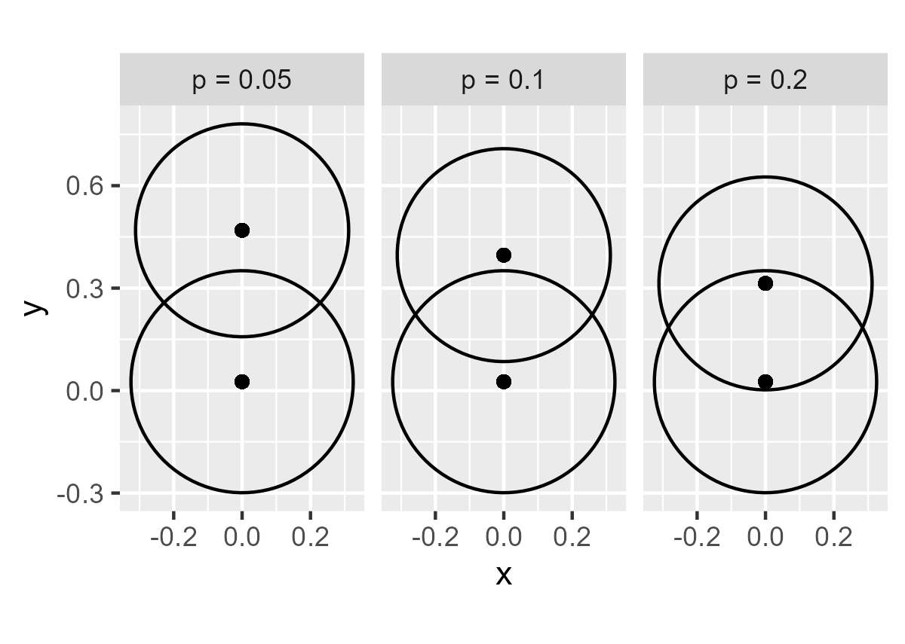

<!--- Timestamp to trigger book rebuilds: 2025-07-28 13:46:43.455275 --->


## July 2025 (Smaller bits)

<small>Source: <code>2025-07-14.Rmd</code></small>

*The other July 2025 file compiles a Stan model, so let's use a separate
file to avoid rebuilding that entry unnecessarily.*

**There are three different meanings of "weights" in statistics**
[explains Thomas Lumley][tl-weights]: Precision/analytic weights,
frequency weights, and sampling/probability/design/gross-up weights. The
second type is a count for a response (like how we can condense 50 coin
flips into a single binomial response), and the third type is
reweighting to get a sample to match a larger population. The first type
is the one we used in weighted empirical logit back in the day where we
had to encode information about the precision of the observation:


``` r
littlelisteners::empirical_logit
#> function (x, y) 
#> {
#>     log((x + 0.5)/(y + 0.5))
#> }
#> <bytecode: 0x0000017342e30650>
#> <environment: namespace:littlelisteners>

littlelisteners::empirical_logit_weight
#> function (x, y) {
#>     var1 <- 1/(x + 0.5)
#>     var2 <- 1/(y + 0.5)
#>     var1 + var2
#> }
#> <bytecode: 0x0000017342e32ee8>
```

(In retrospect, I should have returned `1 / (var1 + var2)` from this
function. I think the motivation at the time was that the `lmer()` code
examples floating around used `weights = 1 / wt` so this function would not 
have broken anything.)

[tl-weights]: https://notstatschat.rbind.io/2020/08/04/weights-in-statistics/ "Weights in statistics"

**Don't use AIC to compare a discrete and a continuous model** [says
Thomas Lumley][tl-aic]. "The loose way to talk about the problem is that the
continuous model’s loglikelihood comes from a probability density function while
the discrete model’s loglikelihood comes from a probability mass function, and
these are just two different things. You can’t divide one by the other."

[tl-aic]: https://notstatschat.rbind.io/2025/07/22/aic-and-combined-discrete-continuous-models/ "AIC and combined discrete/continuous models"

📌 Two-tailed *p*-value: `2 * pt(-abs(t), df)`, or to stay on the log-scale
`log(2) + pt(-abs(t), df, log.p = TRUE)`.


### p-values and confidence interval overlaps

Two 95% confidence intervals can overlap and still have a statistically
significant difference at *p* = .05. I want to refresh my memory on what
*p*-values are implied by different degrees of overlap and simulate the
rules of thumb myself.

Cumming ([2008](https://doi.org/10.1002/sim.3471)) provides a summary of
some visual rules of thumb. (This is the same author of 2014 [The New
Statistics](https://doi.org/10.1177/0956797613504966) manifesto.) Here
are the main points I wanted to recall:

  - Two 95% intervals can overlap by a small amount at *p* = .01.
  - Two 83.5% intervals will just touch at *p* = .05.
  - Two 95% intervals can overlap up to half the length of an interval
    whisker at *p* = .05.

We simulate data sets that yield a target *p*-value.


``` r
simulate_group_data_for_given_p_value <- function(
    p_target, 
    n_a = 40, 
    n_b = NULL, 
    sd_a = 1, 
    sd_b = NULL, 
    seed = NULL
) {
  if (!is.null(seed)) withr::local_seed(seed)
  n_b <- n_b %||% n_a
  sd_b <- sd_b %||% sd_a
  data_a <- rnorm(n_a, 0, sd_a)
  data_b <- rnorm(n_b, 0, sd_b)
  
  get_p_val <- function(diff) t.test(data_a, data_b + diff)[["p.value"]]
  
  target_diff <- uniroot(
    f = function(x) get_p_val(x) - p_target,
    interval = c(0, 5 * sd_a),
    tol = p_target / 1000,
    extendInt = "yes"
  )
  data.frame(
    group = c(rep("a", n_a), rep("b", n_b)),
    value = c(data_a, data_b + target_diff$root),
    target_p_value = paste0("p = ", p_target)
  )
}
```

Test the data simulation functions.


``` r
data1 <- simulate_group_data_for_given_p_value(.05, seed = 20250723)
t.test(value ~ group, data1) |> 
  broom::tidy() |> 
  str()
#> tibble [1 × 10] (S3: tbl_df/tbl/data.frame)
#>  $ estimate   : num -0.443
#>  $ estimate1  : num 0.026
#>  $ estimate2  : num 0.469
#>  $ statistic  : Named num -1.99
#>   ..- attr(*, "names")= chr "t"
#>  $ p.value    : num 0.05
#>  $ parameter  : Named num 77.9
#>   ..- attr(*, "names")= chr "df"
#>  $ conf.low   : num -0.887
#>  $ conf.high  : num -8.44e-07
#>  $ method     : chr "Welch Two Sample t-test"
#>  $ alternative: chr "two.sided"

data2 <- simulate_group_data_for_given_p_value(.01, seed = 20250723)
t.test(value ~ group, data2) |> 
  broom::tidy() |> 
  str()
#> tibble [1 × 10] (S3: tbl_df/tbl/data.frame)
#>  $ estimate   : num -0.588
#>  $ estimate1  : num 0.026
#>  $ estimate2  : num 0.614
#>  $ statistic  : Named num -2.64
#>   ..- attr(*, "names")= chr "t"
#>  $ p.value    : num 0.01
#>  $ parameter  : Named num 77.9
#>   ..- attr(*, "names")= chr "df"
#>  $ conf.low   : num -1.03
#>  $ conf.high  : num -0.145
#>  $ method     : chr "Welch Two Sample t-test"
#>  $ alternative: chr "two.sided"
```

Create a grid of CIs and plot them. `Hmisc::smean.cl.normal()` is used by 
ggplot2 to compute the CI, and this function "the sample mean and
lower and upper Gaussian confidence limits based on the
*t*-distribution".


``` r
library(tidyverse)
mean_ci <- function(x, width) {
  df <- ggplot2::mean_cl_normal(x, conf.int = width)
  df[[".width"]] <- width
  df
}

data <- bind_rows(
  data1, 
  data2,
   simulate_group_data_for_given_p_value(.005, seed = 20250723)
)

cis <- data |> 
  group_by(group, target_p_value) |> 
  reframe(
    ci = list(mean_ci(value, .95), mean_ci(value, .835))
  ) |> 
  tidyr::unnest(cols = ci)

ggplot(cis) + 
  aes(x = factor(.width), color = group) +
  geom_pointrange(
    aes(ymin = ymin, y = y, ymax = ymax),
    position = position_dodge(width = .25)
  ) + 
  facet_wrap(~target_p_value) +
  guides(color = "none") + 
  scale_x_discrete(
    "Confidence interval",
    labels = function(x) scales::label_percent(.1)(as.numeric(x))
  ) +
  labs(y = NULL) +
  theme_grey(base_size = 14)
```

<figure>
  
  <figcaption></figcaption>
</figure>

I was also intrigued by the following remark:

> Sall [28] described an ingenious variation of overlap: Around any
> mean, draw a circle with radius equal to the margin of error of the 95
> per cent CI. Sall showed that if two such circles overlap so that they
> intersect at right angles, *p* = 0.05 for the comparison of the two
> means.

So, when *p* = .05, the tangents at the intersections are right angles:


``` r
data_circles <- data1 |> 
  bind_rows( 
    simulate_group_data_for_given_p_value(.10, seed = 20250723),
    simulate_group_data_for_given_p_value(.20, seed = 20250723)  
  ) |> 
  group_by(group, target_p_value) |> 
  reframe(
    ci = mean_ci(value, .95)
  ) |> 
  tidyr::unnest(cols = ci) |> 
  filter(.width == .95) |> 
  mutate(
    radius = (ymax - ymin) / 2
  ) |> 
  rowwise() |> 
  mutate(
    angle = list(seq(0, 2 * pi, length.out = 100))
  ) |> 
  ungroup() |> 
  tidyr::unnest(cols = angle) |> 
  mutate(
    circle_x = cos(angle) * radius, 
    circle_y = y + sin(angle) * radius
  )

ggplot(data_circles) +
  geom_point(aes(x = 0, y = y)) +
  geom_path(aes(group = y, x = circle_x, y = circle_y)) + 
  facet_wrap(~target_p_value) +
  coord_fixed()
```

<figure>
  
  <figcaption></figcaption>
</figure>


### Scrapped helper functions for a list of models

I was making a notebook with a list of related models, like


``` r
m <- list(
  mpg_wt = lm(mpg ~ wt, mtcars),
  mpg_disp = lm(mpg ~ disp, mtcars),
  mpg_disp_wt = lm(mpg ~ disp + wt, mtcars),
  mpg_disp_wt_int = lm(mpg ~ disp * wt, mtcars),
  hp_wt = lm(hp ~ wt, mtcars),
  hp_disp = lm(hp ~ disp, mtcars),
  hp_disp_wt = lm(hp ~ disp + wt, mtcars),
  hp_disp_wt_int = lm(hp ~ disp * wt, mtcars)
)
```

I want to select a subset of models and `anova()` them, so I made a quick
tidyselect function and an S3 method method of lists with `anova()`:


``` r
library(tidyverse)

list_select <- function(l, ...) {
  pos <- tidyselect::eval_select(c(...), l)
  rlang::set_names(l[pos], names(pos))
}

anova.list <- function(object) {
  do.call(anova, unname(object))
}

m |> 
  list_select(starts_with("mpg")) |> 
  list_select(matches("disp")) |> 
  anova()
#> Analysis of Variance Table
#> 
#> Model 1: mpg ~ disp
#> Model 2: mpg ~ disp + wt
#> Model 3: mpg ~ disp * wt
#>   Res.Df    RSS Df Sum of Sq      F   Pr(>F)   
#> 1     30 317.16                                
#> 2     29 246.68  1    70.476 11.694 0.001942 **
#> 3     28 168.75  1    77.934 12.931 0.001227 **
#> ---
#> Signif. codes:  0 '***' 0.001 '**' 0.01 '*' 0.05 '.' 0.1 ' ' 1

anova(m$mpg_disp, m$mpg_disp_wt, m$mpg_disp_wt_int)
#> Analysis of Variance Table
#> 
#> Model 1: mpg ~ disp
#> Model 2: mpg ~ disp + wt
#> Model 3: mpg ~ disp * wt
#>   Res.Df    RSS Df Sum of Sq      F   Pr(>F)   
#> 1     30 317.16                                
#> 2     29 246.68  1    70.476 11.694 0.001942 **
#> 3     28 168.75  1    77.934 12.931 0.001227 **
#> ---
#> Signif. codes:  0 '***' 0.001 '**' 0.01 '*' 0.05 '.' 0.1 ' ' 1
```

`list_select()` is extremely basic. It's based on the examples in the
`tidyselect::eval_select()` documentation. 

For `list_select()`, the closest option available from purrr (the
tidyverse package for working on lists) is `purrr::keep_at()`:


``` r
m |> 
  purrr::keep_at(function(x) startsWith(x, "mpg")) |> 
  str(max.level = 1)
#> List of 4
#>  $ mpg_wt         :List of 12
#>   ..- attr(*, "class")= chr "lm"
#>  $ mpg_disp       :List of 12
#>   ..- attr(*, "class")= chr "lm"
#>  $ mpg_disp_wt    :List of 12
#>   ..- attr(*, "class")= chr "lm"
#>  $ mpg_disp_wt_int:List of 12
#>   ..- attr(*, "class")= chr "lm"
```


### Model condition number and `kappa()`

A colleague got the following warning when fitting a regression model in Python:

> The condition number is large, 3.11e+03. This might indicate that
> there are strong multicollinearity or other numerical problems.

We can compute this [condition
number](https://en.wikipedia.org/wiki/Condition_number) in R via
`kappa()`


``` r
m_mpg_disp_wt_int <- lm(mpg ~ disp * wt, mtcars)
kappa(m_mpg_disp_wt_int, exact = TRUE)
#> [1] 8508.152
```

This kappa score indicates *something* about sensitivity or stability in
the model. "The condition number bounds how much the solution *z* of a
system of equations *Az*=*c* can change, on a relative basis, when its
components *A* and *c* are changed," says [whuber on
CV](https://stats.stackexchange.com/a/168276/14825).

R computes its default kappa from the ratio of the first and last
singular values of the upper triangle of the model's QR matrix. (I read
the [source
code](https://github.com/wch/r-source/blob/637e502dbc868d39f0813a6a2a5ef0469fe8e73e/src/library/base/R/kappa.R#L97-L121).)


``` r
zero_out_lower_tri <- function(m) { m[lower.tri(m)] <- 0; m }
d <- m_mpg_disp_wt_int$qr$qr |> 
  # there are 4 columns, so we are making a square
  _[1:4, 1:4] |>
  zero_out_lower_tri() |> 
  svd() |> 
  _$d

d[1] / d[length(d)]
#> [1] 8508.152
```

There is a lot of mathematical indirection here but the intuition I'm
hanging onto is that if the [SVD is warping a "circle" into an
"ellipse"](https://en.wikipedia.org/wiki/Singular_value_decomposition#Intuitive_interpretations),
the ratio in kappa is the ratio of longest and shortest axes in that
ellipse.


We can reduce this condition number by (roughly) centering our predictors:


``` r
mean(mtcars$disp)
#> [1] 230.7219
mtcars$disp_230 <- mtcars$disp - 230 

mean(mtcars$wt)
#> [1] 3.21725
mtcars$wt_3 <- mtcars$wt - 3 

m_mpg_disp_wt_int <- lm(mpg ~ disp_230 * wt_3, mtcars)
kappa(m_mpg_disp_wt_int, exact = TRUE)
#> [1] 447.5556
```

I prefer kind of rough centering to nice round numbers so that the
intercept can be easily described, and the centering constants can be
remembered. When more exact centering is needed, I do full on
*z*-scores instead:


``` r
mtcars$z_disp <- mtcars$disp |> scale() |> as.vector()
mtcars$z_wt <- mtcars$wt |> scale() |> as.vector()

m_mpg_disp_wt_int <- lm(mpg ~ z_disp * z_wt, mtcars)
kappa(m_mpg_disp_wt_int, exact = TRUE)
#> [1] 5.065835
```

As we can see, this transformation made a tremendous improvement in
condition number.

*Why doesn't R raise a warning?* There are probably lots of good reasons
to not warn by default, because we are dealing with a diagnostic score
and rules of thumb for interpreting it. That said, I was not able to
find a clear answer from an R (or S) author about why R doesn't warn
about the condition number or multicollinearity.

### Resuming a renv project

Steps for resuming a renv project when you don't care about restoring
the previous package environment.

  - Make life easier with `utils::install.packages(c("usethis", "gitcreds"))`
    to avoid problems with GitHub credentials if you use GitHub packages.

  - Install renv anew and then do `renv::record("renv@1.1.4")` or
    whatever to record that version.

  - Install the packages used by the project. We can use `renv::update()` or 
    install as needed as we run code in the project's files.
    
  - Take a `renv::snapshot()`.
  
Note that the way to record an updated version of R is with `renv::snapshot()`.
