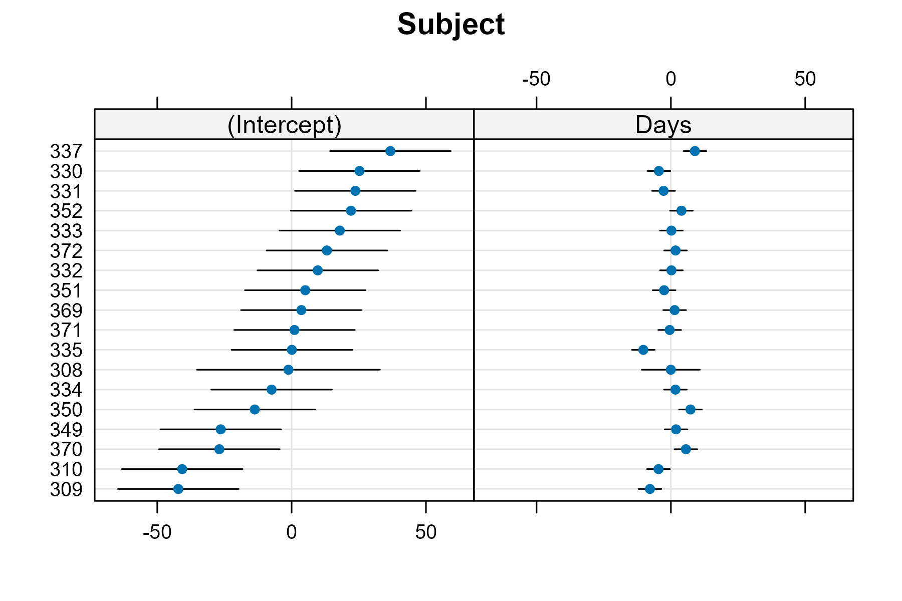

<!--- Timestamp to trigger book rebuilds: 2025-08-06 14:46:27.483099 --->


## August 2025

<small>Source: <code>2025-08-01.Rmd</code></small>

🦜 "(Recall the dictum that mixture models all have computational
problems and that all computational problems are essentially mixture
models.)" - Andrew Gelman [commenting on a
comment][gelman-mixture-comment].

🦜 ‘Because this generation of symptoms entails a complex of
"subject-internal" activities, we can never speak in the strictest sense
in terms of simulator-centered "nocebo effects", but only in terms of
subject-centered "nocebo responses".’ - [Wikipedia][nocebo-wiki]
being intriguingly pedantic insisting that there is no placebo "effect",
only placebo "responses".

🔗 A [treatment of NA values][na-values-monad] with wrapper functions
with a comparison to monads.

[gelman-mixture-comment]: https://statmodeling.stat.columbia.edu/2025/07/31/bio/
[nocebo-wiki]: https://en.m.wikipedia.org/wiki/Nocebo
[na-values-monad]: https://www.biobits.be/biofunctor/2025/07/23/lets-talk-about-nas/

I need to make a keyboard shortcut to extract Markdown 
`[inline links](long-url)` and convert them to `[reference links][ref]`.

*** 

I had to compare how each listener differed from the mean of the other
listeners, so I cooked up:

```
leave_one_out_apply <- function(xs, f, ...) {
  lapply(seq_along(xs), function(i) f(xs[-i], ...) )
}
```

### Computing the standard error of a BLUP in lme4

In lme4, when we plot random effects with lattice---which is a useful
thing we can do!---we get point estimates and 95% intervals for each
participant's conditional modes or subject-specific parameter values (a.k.a.,
BLUPs):


``` r
# knock out some rows for subject 308
sleepstudy <- lme4::sleepstudy[-c(2:10),]
m <- lme4::lmer(Reaction ~ Days + (Days | Subject), sleepstudy)

re <- lme4::ranef(m)
p <- lattice::dotplot(re)
p
#> $Subject
```

<figure>
  
  <figcaption></figcaption>
</figure>

There is uncertainty about these point estimates. Participant 308, whose
data we removed 90% of, has wider intervals. How can we compute this kind of 
conditional standard error in an lme4 model?

Most directly, we can use `as.data.frame()`:


``` r
as.data.frame(re) |> 
  head()
#>    grpvar        term grp    condval   condsd
#> 1 Subject (Intercept) 308  -1.178478 17.36926
#> 2 Subject (Intercept) 309 -42.170585 11.45419
#> 3 Subject (Intercept) 310 -40.726660 11.45419
#> 4 Subject (Intercept) 330  25.264641 11.45419
#> 5 Subject (Intercept) 331  23.718459 11.45419
#> 6 Subject (Intercept) 332   9.726814 11.45419
```


For each participant's estimates, there is a corresponding conditional
covariance matrix. These matrices are stored in an attribute called `"postVar"`.


``` r
# conditional covariance
# postVar is a 3D array. the last dimension indexes participants
attr(re$Subject, "postVar")[, , 1]
#>            [,1]      [,2]
#> [1,] 301.691068  4.141167
#> [2,]   4.141167 30.400910

# standard errors as sqrt of covariance matrix
attr(re$Subject, "postVar")[, , 1] |> diag() |> sqrt()
#> [1] 17.369256  5.513702

# compare with SEs provided by another package
broom.mixed::tidy(m, effects = "ran_vals") |> 
  subset(level == "308")
#> # A tibble: 2 × 6
#>   effect   group   level term        estimate std.error
#>   <chr>    <chr>   <chr> <chr>          <dbl>     <dbl>
#> 1 ran_vals Subject 308   (Intercept)  -1.18       17.4 
#> 2 ran_vals Subject 308   Days         -0.0162      5.51
```

Sidenote: Maybe I should have said SD instead of SE? The terminology is hard.

### Forwarding a function definition into a knitr code chunk

I am writing some Supplemental Materials for an analysis and I want to
include modeling functions in the knitr document but

  - a function should be only defined once
  - a function should be displayed (syntax highlighted) and executed
    like normal R code
  - ideally, I should be able to copy-paste the displayed code and run
    it interactively.

This is a bit of a disconnect between (1) the source code that we write
and see when print out a function and (2) the parsed source code for a
function. One is for humans and one is for a machine. This code is
running via knitr right now, so `source()` just keeps the parsed source
code.


``` r
# Write out a function to source() in
t <- tempfile(fileext = ".R")
def <- "
# This is a simple function for demonstration purposes
my_func <- function(x) {
  # default to 0
  if (!is.null(x)) x else 0
}"
writeLines(def, t)

source(t, local = TRUE)

my_func
#> function (x) 
#> {
#>     if (!is.null(x)) 
#>         x
#>     else 0
#> }
#> <environment: 0x0000019a76263880>
```

We lost our comment and the function is printed with that weird
formatting for `if` statements that is impossible to run line-by-line in
RStudio

We need to tell `source()` to keep the source code. (I think
`keep.source = TRUE` is the default in interactive R sessions, but I
have to toggle it on in knitr/RMarkdown.)


``` r
source(t, local = TRUE, keep.source = TRUE)

my_func
#> function(x) {
#>   # default to 0
#>   if (!is.null(x)) x else 0
#> }
#> <environment: 0x0000019a76263880>
```

So far, we have a way to include the original source code for the
function body. Now, we'd like to make it display the original function
definition---that is, with the ` my_func <-  ` assignment. We can do
that by consulting the source-reference for the file.

(If this were a blog post, there'd be an image of Obiwan say "Use the
source, Luke" about here.)

Attached to the function is a `"srcref"` attribute (see `srcref()`).
This attribute includes a vector with various bits of information
including starting and ending lines for the function definition. This
attribute also has a `"srcfile"` with the original source file.


``` r
my_func |> attr("srcref") |> str()
#>  'srcref' int [1:8] 3 12 6 1 12 1 3 6
#>  - attr(*, "srcfile")=Classes 'srcfilecopy', 'srcfile' <environment: 0x0000019a8006b198>

my_func |> attr("srcref") |> attr("srcfile") |> str()
#> Classes 'srcfilecopy', 'srcfile' <environment: 0x0000019a8006b198>
```

The first and third elements of the vector are the starting and ending line
numbers of the function definition in the source file. We can print the 
function source like so:


``` r
line_range <- attr(my_func, "srcref") |> as.integer() |> _[c(1, 3)]

my_func_source <- attr(my_func, "srcref") |> 
  attr("srcfile") |> 
  _$lines[seq(from = line_range[1], to = line_range[2])]

writeLines(my_func_source)
#> my_func <- function(x) {
#>   # default to 0
#>   if (!is.null(x)) x else 0
#> }
```

But we can even do a little better. If we move the starting line up by one,
we can include the leading comment:


``` r
line_range[1] <- line_range[1] - 1

my_func_source <- attr(my_func, "srcref") |> 
  attr("srcfile") |> 
  _$lines[seq(from = line_range[1], to = line_range[2])]

writeLines(my_func_source)
#> # This is a simple function for demonstration purposes
#> my_func <- function(x) {
#>   # default to 0
#>   if (!is.null(x)) x else 0
#> }
```

To make the R function definition display as actual R code in knitr, we 
can use the `code` chunk option:


```` default
```{r, code = my_func_source}
```
````

Which yields


``` r
# This is a simple function for demonstration purposes
my_func <- function(x) {
  # default to 0
  if (!is.null(x)) x else 0
}
```

Hilariously, because `eval = TRUE` by default on that previous code chunk, I
have overwritten `my_func` with itself and lost that srcref information. For the
sake of demonstration, let's re-source it.


``` r
attr(my_func, "srcref")
#> NULL

source(t, local = TRUE, keep.source = TRUE)

attr(my_func, "srcref")
#> function(x) {
#>   # default to 0
#>   if (!is.null(x)) x else 0
#> }
```

I have developed this approach for gathering R source code for functions
into the following function. (The code chunk uses `code =
get_function_source_lines(get_function_source_lines)`!)


``` r
# See notebook/2025-08-01.Rmd
get_function_source_lines <- function(f, include_leading_comments = TRUE) {
  f_string <- if (is.character(f)) f else as.character(substitute(f))
  f <- if (is.character(f)) get(f, envir = parent.frame()) else f
  srcref <- attr(f, "srcref")
  src <- attr(srcref, "srcfile")

  if (is.null(srcref)) {
    lines <- deparse(f)
    lines[1] <- paste0(f_string, " <- ", lines[1])
    return(lines)
  }

  line_range <- as.integer(srcref)[c(1, 3)]
  line_start <- line_range[1]
  can_check_comments <- include_leading_comments

  while (can_check_comments && line_start > 1) {
    # fyi: not worrying about indented comments
    has_leading_comment_line <- src$lines[line_start - 1] |> startsWith("#")
    line_start <- line_start - as.integer(has_leading_comment_line)
    can_check_comments <- has_leading_comment_line
  }

  getSrcLines(src, line_start, line_range[2])
}
```

The function retrieves leading comments by scanning the lines preceding the 
function definition and changing the line start.


``` r
my_func |> get_function_source_lines() |> writeLines()
#> # This is a simple function for demonstration purposes
#> my_func <- function(x) {
#>   # default to 0
#>   if (!is.null(x)) x else 0
#> }
```


This function defaults to using `{NAME} <- {BODY}` if there is no srcref
available. 


``` r
srcless_my_func <- utils::removeSource(my_func)
srcless_my_func |> get_function_source_lines() |> writeLines()
#> srcless_my_func <- function (x) 
#> {
#>     if (!is.null(x)) 
#>         x
#>     else 0
#> }
```

There is that terrible formatting, but at least it includes the
assignment. We can ask a package to reformat the function for us though.


``` r
srcless_my_func |> get_function_source_lines() |> formatR::tidy_source(text = _)
#> srcless_my_func <- function(x) {
#>     if (!is.null(x))
#>         x else 0
#> }

srcless_my_func |> get_function_source_lines() |> styler::style_text()
#> srcless_my_func <- function(x) {
#>   if (!is.null(x)) {
#>     x
#>   } else {
#>     0
#>   }
#> }
```

This function can also handle names of functions as character strings.
But please don't push this idea:


``` r
get_function_source_lines("my_func") |> writeLines()
#> # This is a simple function for demonstration purposes
#> my_func <- function(x) {
#>   # default to 0
#>   if (!is.null(x)) x else 0
#> }

func_name <- "my_func"
get_function_source_lines(func_name) |> writeLines()
#> # This is a simple function for demonstration purposes
#> my_func <- function(x) {
#>   # default to 0
#>   if (!is.null(x)) x else 0
#> }

# you can't use a string that names a string that names a function
get_function_source_lines("func_name") |> writeLines()
#> func_name <- "my_func"
```

If we try to rename the function, the original name is shown because it is still
being retrieved from the source reference.


``` r
my_________________func <- my_func
get_function_source_lines(my_________________func) |> writeLines()
#> # This is a simple function for demonstration purposes
#> my_func <- function(x) {
#>   # default to 0
#>   if (!is.null(x)) x else 0
#> }
```

### Positron notes

Getting up and running with R is pretty straightforward: install R,
install RStudio, install packages from CRAN, and off you go. Python is
more, uh, nonlinear: Install an environment manager and have it cordon
off little subversions of Python and sublibraries, install some IDE or
work in the browser 🤷. I'm not a Python guy; I don't know the easy route
to get up and running. I know that there is some amount of configuration 
overhead. 

This contrast between R and Python also describes the different
experiences between RStudio and Positron. Why does it feel like I'm
always configuring stuff in Positron? Well, it's because it inherits
from VSCode and VSCode is for *everything* and you can't support
*everything* without being extremely configurable or "hackable". Plus, I
don't know what I want from Positron quite yet, and RStudio has had
like 10 year headstart on Positron, so I'm going to remain charitable
and supportive of the team.

That said, here are keyboard shortcuts I added recently. I would have
added [WrapRmd](https://github.com/tjmahr/WrapRmd) but they need to [fix
some things](https://github.com/posit-dev/positron/issues/8771).

```json
// Place your key bindings in this file to override the defaults
[
  {
    // targets::tar_load() a symbol
    "key": "ctrl+shift+alt+l",
    "command": "workbench.action.executeCode.console",
    "when": "editorTextFocus",
    "args": {
        "langId": "r",
        "code": "targets::rstudio_addin_tar_load()",
        "focus": false
    }
  },
  {
    // Preview result of knitr::knit() on selection
    "key": "ctrl+shift+alt+k",
    "command": "workbench.action.executeCode.console",
    "when": "editorTextFocus",
    "args": {
        "langId": "r",
        "code": "WrapRmd::knit_selection_addin()",
        "focus": false
    }
  }
]
```


